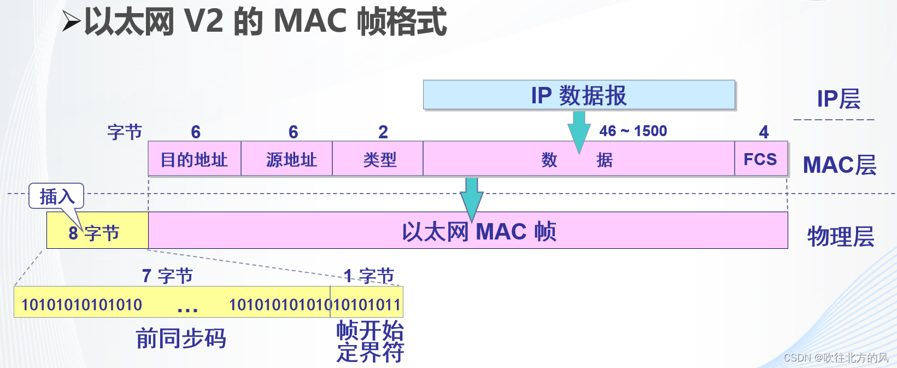

### 3.3.1 局域网的数据链路层

- 局域网最主要的特点是：
	- 网络为一个单位所拥有
	- 地理范围和站点数目均有限
- 局域网具有如下主要优点
	- 具有广播功能
	- 便于系统扩展和逐渐演变
	- 提高了系统的可靠性、可用性和生存性

**局域网拓扑结构**

a. 星形网

b. 环形网

c. 总线网

**以太网中的媒体共享技术**

1. 静态划分信道

2. 动态媒体划分信道
	- 随机接入
	- 受控接入

#### 1. 数据链路层的两个子层

##### 逻辑链路控制LLC（Logical Link Control）

##### 媒体接入控制MAC（Medium Access Control）

#### 2. 适配器的作用

- 适配器：PCMCIA卡，又叫**网络接口卡NIC**

### 3.3.2 CSMA/CD协议

- 最初的以太网将许多计算机连接在总线上，采用广播通信的方式，也可以实现一对一通信

以太网为简便通信采取的措施

1. 采用较为灵活的无连接的工作方式
2. 发送的数据都是用**曼彻斯特编码**的信号

#### CSMA/CD协议

- 含义：Carrier Sense Multiple Access/collision detection，带有冲突检测的载波检听多路存取
- “多点接入”表示许多计算机以多点接入的方式连接在一根总线上
- “载波监听”指每一个站在发送数据之前都要检测一下总线上是否有其他计算机在发送数据，如果有，则暂时不要发送数据，以免发生碰撞
- 总线上并没有什么“载波”。因此，“载波监听”就是用电子技术检测总线上有没有其他计算机发送的数据信号

#### 碰撞检测

- 计算机边发送数据边检测信道上的信号电压大小
- 当几个站同时在总线上发送数据时，总线上的信号电压摆动值将会增大（互相叠加）
- 当一个站检测到的信号电压摆动值超过一定的门限值时，就认为总线上至少有两个站在同时发送数据，表明产生了碰撞
- 也称“冲突检测”

#### 检测到碰撞后

- 在发生碰撞后，产生严重失真，无法从中恢复出有用的数据
- 每一个正在发送数据的站，一旦发现发生了碰撞，就要**立即停止发送**，等待**随机时间**后再次发送

#### 信号传播时延最载波监听的影响

- 原因：电磁波在总线上的传播速率是有限的
	- A向B发出的信息，要经过一定的时间才能传送到B
	- B在接到A的信息前误以为信道空闲，发送自己的帧，则随后发生碰撞
	- 两个帧都变得无用
- 在发送期间需要进行碰撞检测，以检测冲突

**最短有效帧长**

如果一个帧太短，发送方很快就能发送完毕而检测不到碰撞，但这个帧却有可能在到达目的主机的途中与其他主机发送的帧发生碰撞。由于不再监听信道，发送方无法知道这个帧发生了碰撞。

**帧间最小间隔**

以太网还规定帧间最小间隔为 9.6 **µs** 。一台计算机在检测到总线开始空闲后，还要等待 9.6 **µs** 才能再次发送数据。

#### 争用期


#### 二进制指数类型退避算法

- 发生碰撞的站退避一个随机时间才能再发送数据

	- ​	基本退避时间为争用期$2\tau$

	- 从整数集合$[0,1,...,(2^{k}-1)]$中随机取出一个数，记为$r$

		重传所需的时延就是$r$倍的基本退避时间:$r2\tau$

		$k=Min[重传次数,10]$

	- 重传16次仍不成功时，丢弃该帧，并向高层报告

#### 强化碰撞

检测到碰撞之后

- 立即停止发送数据
- 再继续发送32bit或48bit**人为干扰信号**，以便让所有用户知道碰撞发生

### 3.3.3 使用集线器的星型拓扑

- 这种使用双绞线的星形以太网又叫 10BASE-T 以太网。“10”代表 10 Mbit/s 的数据率，BASE 表示连接线上的信号是基带信号，T 代表双绞线。
- 10BASE-T 以太网的通信距离稍短，每个站到集线器的距离不超过 100 m。
- 10BASE-T 以太网是局域网发展史上的一个非常重要的里程碑，它奠定了以太网在局域网中的统治地位。

1. 集线器使用电子器件来模拟实际电缆线的工作。使用集线器的以太网在物理上是一个星形网，但在逻辑上仍是一个总线网，各主机使用的还是 CSMA/CD 协议（更具体来说，是各主机中适配器执行CSMA/CD协议），并共享逻辑上的总线。
2. 一个集线器有许多端口，每个端口通过RJ-45插头用两对双绞线与一台计算机的适配器相连。
3. 集线器工作在物理层，它的每个接口仅简单地转发比特，不进行碰撞检测。

### 3.3.4 以太网的信道利用率

若一个 10Mbps（Mbit/s） 的以太网**同时**有 10 个站工作，每个站所能发送数据的平均速率并不是 1 Mbps 。因为多个站在以太网上同时工作就可能发生碰撞。发生碰撞时信道资源被浪费
扣除这些浪费，以太网的信道利用率不可能达到 100%。

成功发送出一个帧后，需要占用信道的时间实际上是：$To + t $（t 是以太网单程端到端的传播时延），这里要多一个t , 实际上不难理解，这是因为发送的最后一个比特还要再经过时间 t 才能在信道上传送完。就好像火车过一个隧道，$To$ 就等于一个火车完全进入隧道，可能它的头部已经出隧道了，但只有尾部彻底出来隧道（再经过 t），才真正通过。

### 3.3.5 以太网的MAC层

在局域网中，硬件地址又称为物理地址，或 MAC 地址(因为这种地址用在MAC帧中)，长度为 48 位（ip地址：32位）。以太网中的数据帧又叫 MAC 帧。
适配器从网络上每收到一个 MAC 帧就先用硬件检查 MAC 帧中的目的地址。如果是发往本站的帧则收下，然后再进行其他的处理；否则就将此帧丢弃，不再进行其他的处理。
“发往本站的帧”包括以下三种帧：
1. 单播帧（一对一），即帧的目的 MAC 地址与本站的硬件地址相同。
2. 广播帧（一对全体），即发送给本局域网上所有站点的帧，此时帧的目的 MAC 地址为全 1（0xFFFFFFFFFFFF）。
3. 多播帧（一对多），即发送给本局域网上一部分站点（包含本站在内）的帧。

#### MAC帧的格式 
常用的以太网MAC帧格式有两种标准，一种是 DIX Ethernet V2 标准 （即以太网 V2 标准），另一种是 IEEE的 802.3 标准 。

```
⚠️⚠️⚠️MAC帧是数据帧的一种。而所谓数据帧，就是数据链路层的协议数据单元，它包括三部分：帧头，数据部分，帧尾。其中，帧头和帧尾包含一些必要的控制信息，比如同步信息、地址信息、差错控制信息等；数据部分则包含网络层传下来的数据，比如ip数据报。
在发送端，数据链路层把网络层传下来得数据封装成帧，然后发送到链路上去；在接收端，数据链路层把收到的帧中的数据取出并交给网络层。不同的数据链路层协议对应着不同的帧，所以，帧有多种，比如PPP帧、MAC帧等，其具体格式也不尽相同。
我这里说这些基础概念的原因就是：
不要和之前讲的使用点对点信道的PPP帧格式（广域网范畴）混为一谈！！！！
```



1. 从图中可以看出，以太网V2的MAC帧由五个字段组成，前两个字段分别为6字节长的目的地址和源地址字段。第三个字段是2字节长的类型字段（用来标志上一层使用的是什么协议，以便把收到的MAC 帧的数据上交给上一层的这个协议【例如：当类型字段的值是0x0800时，就表示上层协议是 IP 协议】） ，第四个字段是数据字段（最小长度 64 字节 - 18 字节的首部和尾部 = 数据字段的最小长度 ）， 最后一个字段是4字节的帧检验序列FCS（使用CRC检验）。

2. 若数据字段的长度小于 46 字节，封装成帧时就会在数据字段的后面加入整数字节的填充字段，以保证以太网的 MAC 帧长不小于 64 字节。
3. MAC 帧的首部并没有指出数据字段的长度是多少。在有填充字段的情况下，接收端的数据链路层在剥去首部和尾部后就把数据字段和填充字段一起交给上层协议。但这完全不必担心，上层协议具有识别有效的数据字段长度的功能。例如，当上层使用 IP 协议时，其首部就有一个“总长度”字段。
4. MAC 帧中没有帧结束定界符。由于以太网使用曼彻斯特编码，当 MAC 帧发送完毕后，适配器的接口上就不再有电压变化，接收方可以很容易地找到 MAC 帧的结束位置。
5. 插入的 8 字节比特流由两个字段构成，第一个字段占 7 个字节，叫做前同步码，用来使接收端适配器在接收 MAC 帧时迅速实现位同步。第二个字段是帧开始定界符，表示后面的信息就是 MAC 帧。（从数据链路层向下传到物理层时需要在帧的前面插入 8 字节比特流）。
6. 由于 MAC 帧之间有一定的间隔，因此接收端只要找到帧开始定界符，其后连续到达的比特流就都属于同一个 MAC 帧。所以以太网不需要使用帧结束定界符，也不需要使用字节填充来保证透明传输。

 以下为无效的 MAC 帧：

- 帧的长度不是整数个字节
-  用帧检验序列 FCS 查出有差错
- 帧的数据字段的长度不在 46 ~ 1500 字节之间（有效的 MAC 帧长度为 64 ~ 1518 字节之间）

接收方 对于 检查出的无效 MAC 帧就简单地丢弃 